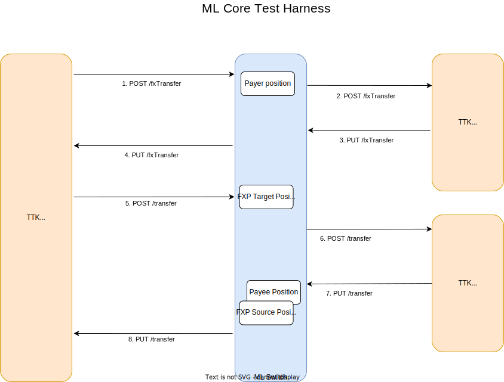

# FX Implementation

## PoC implementation for payer side currency conversion - happy path only

We implemented a proof of concept for FX transfer for a single scenario (Payer side currency conversion) which covers happy path only.
_Note: There is no test coverage and error cases are not handled in this PoC_


### Testing using ml-core-test-harness



To test the functionality, we can use [mojaloop/ml-core-test-harness](https://github.com/mojaloop/ml-core-test-harness)

- Clone the repository
```
git clone https://github.com/mojaloop/ml-core-test-harness.git
```
- Checkout to the branch `feat/fx-impl`
```
git checkout feat/fx-impl
```
- Run the services
```
docker-compose --profile all-services --profile ttk-provisioning --profile ttk-tests --profile debug up -d
```
- Open testing toolkit web UI on `http://localhost:9660`
- Go to `Test Runner`, click on `Collection Manager` and import the folder `docker/ml-testing-toolkit/test-cases/collections`
- Select the file `fxp/payer_conversion.json`
- Run the test case by clicking on `Run` button
- You should see all the tests passed
- Observe the sequence of requests and also the responses in each item in the test case
- Open the last item `Get Accounts for FXP AFTER transfer` and goto `Scripts->Console Logs` and you can observe the position movements of differnt participant accounts there like below.
```
"Payer Position USD : 0 -> 300 (300)"

"Payee Position BGN : 0 -> -100 (-100)"

"FXP Source Currency USD : 0 -> -300 (-300)"

"FXP Target Currency BGN : 0 -> 100 (100)"
```

### Implementation

The implementation is done according to the information available at this repository [mojaloop/currency-conversion](https://github.com/mojaloop/currency-conversion)

The following is the flow diagram to illustrate the flow of a transfer with payer side currency conversion.

