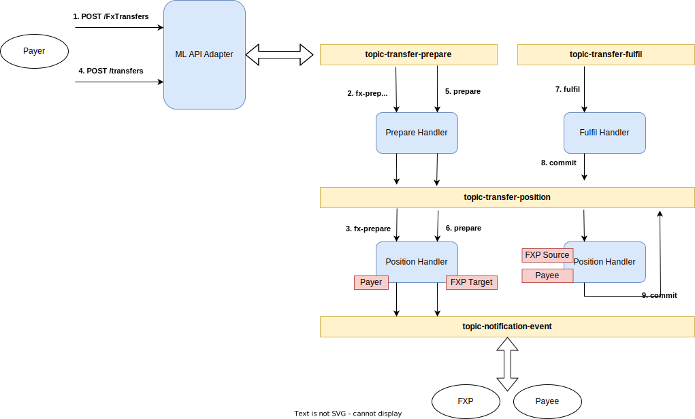

# FX Implementation

## Proof of Concept (PoC) Implementation for Payer-Side Currency Conversion (Happy Path Only)

We have developed a proof of concept for foreign exchange (FX) transfer focusing on a specific scenario: Payer-side currency conversion. Please note that this PoC covers only the happy path, with no test coverage and without handling error cases.

### Testing using ml-core-test-harness


To test the functionality, you can utilize [mojaloop/ml-core-test-harness](https://github.com/mojaloop/ml-core-test-harness):

1. Clone the repository:
    ```
    git clone https://github.com/mojaloop/ml-core-test-harness.git
    ```
2. Checkout to the branch `feat/fx-impl`:
    ```
    git checkout feat/fx-impl
    ```
3. Run the services:
    ```
    docker-compose --profile all-services --profile ttk-provisioning --profile ttk-tests --profile debug up -d
    ```
4. Open the testing toolkit web UI at `http://localhost:9660`.
5. Navigate to `Test Runner`, click on `Collection Manager`, and import the folder `docker/ml-testing-toolkit/test-cases/collections`.
6. Select the file `fxp/payer_conversion.json`.
7. Run the test case by clicking on the `Run` button.
8. Verify that all tests have passed.
9. Observe the sequence of requests and responses in each item of the test case.
10. Open the last item, `Get Accounts for FXP AFTER transfer`, and go to `Scripts->Console Logs` to observe the position movements of different participant accounts, as shown below:
    ```
    "Payer Position BWP : 0 -> 300 (300)"

    "Payee Position TZS : 0 -> -48000 (-48000)"

    "FXP Source Currency BWP : 0 -> -300 (-300)"

    "FXP Target Currency TZS : 0 -> 48000 (48000)"
    ```

### Implementation

The implementation follows the information available in the repository [mojaloop/currency-conversion](https://github.com/mojaloop/currency-conversion).

The flow diagram below illustrates the transfer with payer-side currency conversion:


